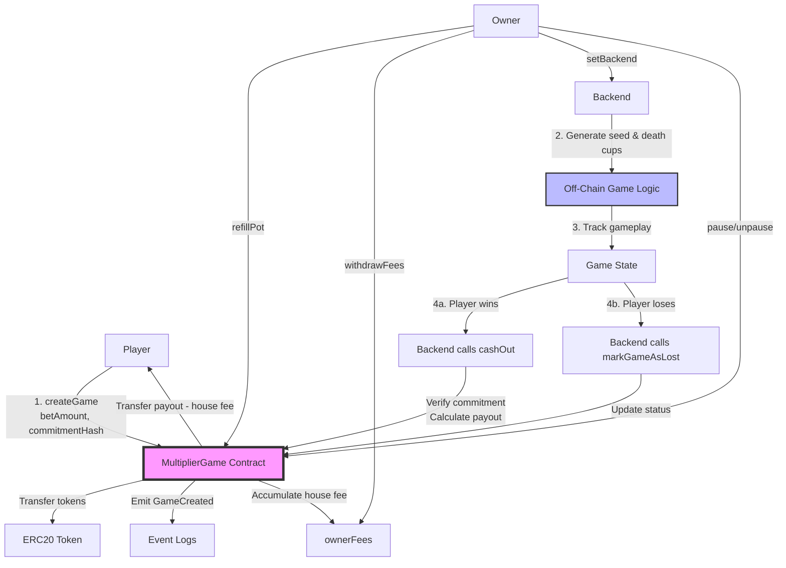

# contract context

path: {project_dir}/contracts
**Pointer-Based Memory System for MultiplierGame Smart Contract Codebase**

---

## SECTION 1: HIGH-LEVEL ARCHITECTURE

### Project Purpose

MultiplierGame is a provably fair multiplier game smart contract that enables on-chain bet custody and payouts using a commit-reveal cryptographic mechanism. The contract enforces risk controls (max bet = 1% of pot, max payout = 5% of pot) while offloading game logic, RNG, and multiplier calculations to an authorized backend. All game outcomes are cryptographically committed before gameplay begins, ensuring provable fairness.

### Entry Points

#### [CMD] Foundry Deployment Script

* **Description:** Solidity-based deployment script for MultiplierGame contract using Foundry's Script system
* **Location:** `script/MultiplierGame.s.sol` (Lines 23-66)
* **Usage:** `forge script script/MultiplierGame.s.sol:MultiplierGameScript --rpc-url <RPC_URL> --broadcast --verify -vvvv`
* **Environment Variables:** `PRIVATE_KEY`, `TOKEN_ADDRESS`, `INITIAL_POT` (optional), `BACKEND_ADDRESS` (optional)

#### [CMD] TypeScript Deployment Script

* **Description:** TypeScript deployment script using viem for contract deployment with automatic pot funding
* **Location:** `js-scripts/deploy.ts` (Lines 52-245)
* **Usage:** `pnpm scripts:deploy` or `NETWORK=base-sepolia TOKEN_ADDRESS=0x... pnpm scripts:deploy`
* **Environment Variables:** `PRIVATE_KEY`, `RPC_URL`, `NETWORK` (anvil|base-sepolia), `TOKEN_ADDRESS`

#### [CMD] TypeScript Token Deployment Script

* **Description:** Deploys ERC20Mock token for testing and development
* **Location:** `js-scripts/deploy-token.ts` (Lines 135-324)
* **Usage:** `pnpm scripts:deploy-token`
* **Environment Variables:** `PRIVATE_KEY`, `RPC_URL`, `NETWORK`, `PLAYER_PRIVATE_KEY` (optional), `MINT_AMOUNT` (optional)

#### [CMD] TypeScript Interaction Demo Script

* **Description:** Comprehensive interaction demo showing game creation, cash out, and owner functions
* **Location:** `js-scripts/interact.ts` (Lines 32-305)
* **Usage:** `pnpm scripts:interact` (requires local Anvil node)
* **Purpose:** Demonstrates full game lifecycle and contract interactions

### Architecture Diagram



### Config & Environment

#### Foundry Configuration

* **File:** `foundry.toml`
* **Solidity Version:** 0.8.28
* **Optimizer:** Enabled (200 runs)
* **Remappings:**
  - `@forge-std/=lib/forge-std/src/`
  - `@openzeppelin/contracts/=lib/openzeppelin-contracts/contracts/`
* **Fuzz Settings:** 256 runs (default), 10 runs (CI profile)

#### Environment Variables

| Variable | Required | Description | Default |
|----------|----------|-------------|---------|
| `PRIVATE_KEY` | Yes | Deployer wallet private key | Anvil account #0 (local only) |
| `RPC_URL` | Conditional | RPC endpoint URL | `http://localhost:8545` (Anvil) |
| `NETWORK` | No | Network name | `anvil` |
| `TOKEN_ADDRESS` | Yes (deploy) | ERC20 token address | None |
| `INITIAL_POT` | No | Initial pot funding amount | `0` |
| `BACKEND_ADDRESS` | No | Backend address to authorize | None |
| `PLAYER_PRIVATE_KEY` | No | Player account for token minting | Anvil account #1 (local only) |
| `MINT_AMOUNT` | No | Token mint amount | `1000000` |

#### Deployment Artifacts

* **Contract Address Storage:** `.deployed-address.json` (created by `js-scripts/deploy.ts`)
* **Token Address Storage:** `.deployed-token.json` (created by `js-scripts/deploy-token.ts`)
* **Compiled Artifacts:** `out/MultiplierGame.sol/MultiplierGame.json`

---

## SECTION 2: LOW-LEVEL DICTIONARY

### Core Contract: MultiplierGame.sol

#### [ENUM] Status

* **Signature:** `enum Status { CREATED, CASHED_OUT, LOST }`
* **Purpose:** Represents the lifecycle state of a game instance
* **Source:** `src/MultiplierGame.sol` : `L17-L21`
* **URL:** `{{Base_URL}}/src/MultiplierGame.sol#L17-L21`

#### [STRUCT] Game

* **Signature:** 
```solidity
struct Game {
    address player;
    uint256 betAmount;
    bytes32 commitmentHash;
    Status status;
    bytes32 preliminaryGameId;
    uint256 createdAt;
    bytes32 seed;
}
```
* **Purpose:** Stores all game state including player address, bet amount, cryptographic commitment, status, and metadata
* **Source:** `src/MultiplierGame.sol` : `L25-L33`
* **URL:** `{{Base_URL}}/src/MultiplierGame.sol#L25-L33`

#### [CONSTANT] HOUSE_EDGE_BPS

* **Signature:** `uint256 public constant HOUSE_EDGE_BPS = 500;`
* **Purpose:** House edge in basis points (5% = 500 bps) deducted from payouts
* **Source:** `src/MultiplierGame.sol` : `L38`
* **URL:** `{{Base_URL}}/src/MultiplierGame.sol#L38`

#### [CONSTANT] MAX_BET_BPS

* **Signature:** `uint256 public constant MAX_BET_BPS = 100;`
* **Purpose:** Maximum bet as percentage of pot in basis points (1% = 100 bps)
* **Source:** `src/MultiplierGame.sol` : `L41`
* **URL:** `{{Base_URL}}/src/MultiplierGame.sol#L41`

#### [CONSTANT] MAX_PAYOUT_BPS

* **Signature:** `uint256 public constant MAX_PAYOUT_BPS = 500;`
* **Purpose:** Maximum payout as percentage of pot in basis points (5% = 500 bps)
* **Source:** `src/MultiplierGame.sol` : `L44`
* **URL:** `{{Base_URL}}/src/MultiplierGame.sol#L44`

#### [CONSTANT] BPS_DENOMINATOR

* **Signature:** `uint256 private constant BPS_DENOMINATOR = 10000;`
* **Purpose:** Basis points denominator for percentage calculations
* **Source:** `src/MultiplierGame.sol` : `L47`
* **URL:** `{{Base_URL}}/src/MultiplierGame.sol#L47`

#### [STATE] token

* **Signature:** `IERC20 public immutable token;`
* **Purpose:** The ERC20 token used for all game operations (bets, payouts, pot funding)
* **Source:** `src/MultiplierGame.sol` : `L52`
* **URL:** `{{Base_URL}}/src/MultiplierGame.sol#L52`

#### [STATE] games

* **Signature:** `mapping(uint256 => Game) public games;`
* **Purpose:** Maps on-chain game IDs to Game structs
* **Source:** `src/MultiplierGame.sol` : `L55`
* **URL:** `{{Base_URL}}/src/MultiplierGame.sol#L55`

#### [STATE] authorizedBackends

* **Signature:** `mapping(address => bool) public authorizedBackends;`
* **Purpose:** Tracks which addresses are authorized to call backend functions (cashOut, markGameAsLost)
* **Source:** `src/MultiplierGame.sol` : `L58`
* **URL:** `{{Base_URL}}/src/MultiplierGame.sol#L58`

#### [STATE] nextOnChainGameId

* **Signature:** `uint256 public nextOnChainGameId;`
* **Purpose:** Auto-incrementing counter for on-chain game IDs
* **Source:** `src/MultiplierGame.sol` : `L61`
* **URL:** `{{Base_URL}}/src/MultiplierGame.sol#L61`

#### [STATE] ownerFees

* **Signature:** `uint256 public ownerFees;`
* **Purpose:** Accumulated house edge fees available for owner withdrawal
* **Source:** `src/MultiplierGame.sol` : `L64`
* **URL:** `{{Base_URL}}/src/MultiplierGame.sol#L64`

#### [EVENT] GameCreated

* **Signature:** 
```solidity
event GameCreated(
    bytes32 preliminaryGameId,
    uint256 indexed onChainGameId,
    address indexed player,
    uint256 betAmount,
    bytes32 commitmentHash
);
```
* **Purpose:** Emitted when a new game is created, providing off-chain indexing data
* **Source:** `src/MultiplierGame.sol` : `L69-L75`
* **URL:** `{{Base_URL}}/src/MultiplierGame.sol#L69-L75`

#### [EVENT] PayoutSent

* **Signature:** 
```solidity
event PayoutSent(
    uint256 indexed onChainGameId,
    uint256 amount,
    address indexed recipient
);
```
* **Purpose:** Emitted when a payout is transferred to a player after successful cash out
* **Source:** `src/MultiplierGame.sol` : `L78-L82`
* **URL:** `{{Base_URL}}/src/MultiplierGame.sol#L78-L82`

#### [EVENT] GameStatusUpdated

* **Signature:** 
```solidity
event GameStatusUpdated(
    uint256 indexed onChainGameId,
    Status status
);
```
* **Purpose:** Emitted when game status changes (CASHED_OUT or LOST)
* **Source:** `src/MultiplierGame.sol` : `L85-L88`
* **URL:** `{{Base_URL}}/src/MultiplierGame.sol#L85-L88`

#### [EVENT] BackendAuthorizationChanged

* **Signature:** 
```solidity
event BackendAuthorizationChanged(
    address indexed backend,
    bool authorized
);
```
* **Purpose:** Emitted when backend authorization status is modified by owner
* **Source:** `src/MultiplierGame.sol` : `L91-L94`
* **URL:** `{{Base_URL}}/src/MultiplierGame.sol#L91-L94`

#### [EVENT] PotRefilled

* **Signature:** 
```solidity
event PotRefilled(
    address indexed funder,
    uint256 amount
);
```
* **Purpose:** Emitted when owner adds funds to the pot
* **Source:** `src/MultiplierGame.sol` : `L97-L100`
* **URL:** `{{Base_URL}}/src/MultiplierGame.sol#L97-L100`

#### [EVENT] FeesWithdrawn

* **Signature:** 
```solidity
event FeesWithdrawn(
    address indexed owner,
    uint256 amount
);
```
* **Purpose:** Emitted when owner withdraws accumulated fees
* **Source:** `src/MultiplierGame.sol` : `L103-L106`
* **URL:** `{{Base_URL}}/src/MultiplierGame.sol#L103-L106`

#### [ERROR] BetExceedsMaxBet

* **Signature:** `error BetExceedsMaxBet(uint256 bet, uint256 maxBet);`
* **Purpose:** Reverted when bet amount exceeds 1% of pot balance
* **Source:** `src/MultiplierGame.sol` : `L110`
* **URL:** `{{Base_URL}}/src/MultiplierGame.sol#L110`

#### [ERROR] PayoutExceedsMaxPayout

* **Signature:** `error PayoutExceedsMaxPayout(uint256 payout, uint256 maxPayout);`
* **Purpose:** Reverted when payout amount exceeds 5% of pot balance
* **Source:** `src/MultiplierGame.sol` : `L111`
* **URL:** `{{Base_URL}}/src/MultiplierGame.sol#L111`

#### [ERROR] InsufficientPot

* **Signature:** `error InsufficientPot(uint256 requested, uint256 available);`
* **Purpose:** Reverted when pot balance is insufficient for requested payout
* **Source:** `src/MultiplierGame.sol` : `L112`
* **URL:** `{{Base_URL}}/src/MultiplierGame.sol#L112`

#### [ERROR] InvalidReveal

* **Signature:** `error InvalidReveal(bytes32 provided, bytes32 expected);`
* **Purpose:** Reverted when commitment hash verification fails during cash out
* **Source:** `src/MultiplierGame.sol` : `L113`
* **URL:** `{{Base_URL}}/src/MultiplierGame.sol#L113`

#### [ERROR] GameNotInCreatedStatus

* **Signature:** `error GameNotInCreatedStatus(uint256 gameId, Status currentStatus);`
* **Purpose:** Reverted when attempting to cash out or mark lost a game that is not in CREATED status
* **Source:** `src/MultiplierGame.sol` : `L114`
* **URL:** `{{Base_URL}}/src/MultiplierGame.sol#L114`

#### [ERROR] NotGamePlayer

* **Signature:** `error NotGamePlayer(address caller, address player);`
* **Purpose:** Reverted when caller is not the game's player (currently unused, reserved for future use)
* **Source:** `src/MultiplierGame.sol` : `L115`
* **URL:** `{{Base_URL}}/src/MultiplierGame.sol#L115`

#### [ERROR] UnauthorizedBackend

* **Signature:** `error UnauthorizedBackend(address caller);`
* **Purpose:** Reverted when non-authorized address attempts to call backend functions
* **Source:** `src/MultiplierGame.sol` : `L116`
* **URL:** `{{Base_URL}}/src/MultiplierGame.sol#L116`

#### [ERROR] InsufficientFees

* **Signature:** `error InsufficientFees(uint256 requested, uint256 available);`
* **Purpose:** Reverted when owner attempts to withdraw more fees than available
* **Source:** `src/MultiplierGame.sol` : `L117`
* **URL:** `{{Base_URL}}/src/MultiplierGame.sol#L117`

#### [ERROR] TransferFailed

* **Signature:** `error TransferFailed();`
* **Purpose:** Reverted when ERC20 transfer operation fails
* **Source:** `src/MultiplierGame.sol` : `L118`
* **URL:** `{{Base_URL}}/src/MultiplierGame.sol#L118`

#### [ERROR] ZeroBet

* **Signature:** `error ZeroBet();`
* **Purpose:** Reverted when bet amount or refill amount is zero
* **Source:** `src/MultiplierGame.sol` : `L119`
* **URL:** `{{Base_URL}}/src/MultiplierGame.sol#L119`

#### [ERROR] InvalidTokenAddress

* **Signature:** `error InvalidTokenAddress();`
* **Purpose:** Reverted when constructor receives zero address for token
* **Source:** `src/MultiplierGame.sol` : `L120`
* **URL:** `{{Base_URL}}/src/MultiplierGame.sol#L120`

#### [MODIFIER] onlyBackend

* **Signature:** `modifier onlyBackend()`
* **Purpose:** Restricts function access to authorized backend addresses
* **Source:** `src/MultiplierGame.sol` : `L125-L130`
* **URL:** `{{Base_URL}}/src/MultiplierGame.sol#L125-L130`

#### [FUNC] constructor

* **Signature:** `constructor(address _token) Ownable(msg.sender)`
* **Purpose:** Initializes contract with ERC20 token address and sets deployer as owner
* **Source:** `src/MultiplierGame.sol` : `L136-L141`
* **URL:** `{{Base_URL}}/src/MultiplierGame.sol#L136-L141`

#### [FUNC] createGame

* **Signature:** `function createGame(bytes32 preliminaryId, bytes32 commitmentHash, uint256 betAmount) external whenNotPaused nonReentrant returns (uint256 onChainGameId)`
* **Purpose:** Creates a new game with bet amount and cryptographic commitment, transfers tokens from player, enforces max bet limit
* **Source:** `src/MultiplierGame.sol` : `L152-L192`
* **URL:** `{{Base_URL}}/src/MultiplierGame.sol#L152-L192`

#### [FUNC] cashOut

* **Signature:** `function cashOut(uint256 gameId, uint256 payoutAmount, bytes32 seed) external nonReentrant onlyBackend`
* **Purpose:** Processes game cash out by verifying commitment, calculating house fee, transferring payout to player, and updating game status
* **Source:** `src/MultiplierGame.sol` : `L201-L229`
* **URL:** `{{Base_URL}}/src/MultiplierGame.sol#L201-L229`

#### [FUNC] getGame

* **Signature:** `function getGame(uint256 gameId) external view returns (Game memory)`
* **Purpose:** Returns complete Game struct for a given game ID
* **Source:** `src/MultiplierGame.sol` : `L236-L238`
* **URL:** `{{Base_URL}}/src/MultiplierGame.sol#L236-L238`

#### [FUNC] markGameAsLost

* **Signature:** `function markGameAsLost(uint256 gameId, bytes32 seed) external onlyBackend`
* **Purpose:** Marks a game as lost when player hits death cup or abandons game, updates status and stores seed
* **Source:** `src/MultiplierGame.sol` : `L247-L259`
* **URL:** `{{Base_URL}}/src/MultiplierGame.sol#L247-L259`

#### [FUNC] setBackend

* **Signature:** `function setBackend(address backend, bool authorized) external onlyOwner`
* **Purpose:** Authorizes or deauthorizes a backend address for calling cashOut and markGameAsLost
* **Source:** `src/MultiplierGame.sol` : `L268-L271`
* **URL:** `{{Base_URL}}/src/MultiplierGame.sol#L268-L271`

#### [FUNC] pause

* **Signature:** `function pause() external onlyOwner`
* **Purpose:** Pauses contract, preventing new game creation via whenNotPaused modifier
* **Source:** `src/MultiplierGame.sol` : `L276-L278`
* **URL:** `{{Base_URL}}/src/MultiplierGame.sol#L276-L278`

#### [FUNC] unpause

* **Signature:** `function unpause() external onlyOwner`
* **Purpose:** Unpauses contract, allowing new game creation
* **Source:** `src/MultiplierGame.sol` : `L283-L285`
* **URL:** `{{Base_URL}}/src/MultiplierGame.sol#L283-L285`

#### [FUNC] refillPot

* **Signature:** `function refillPot(uint256 amount) external onlyOwner`
* **Purpose:** Adds funds to the pot by transferring tokens from owner to contract
* **Source:** `src/MultiplierGame.sol` : `L291-L299`
* **URL:** `{{Base_URL}}/src/MultiplierGame.sol#L291-L299`

#### [FUNC] withdrawFees

* **Signature:** `function withdrawFees(uint256 amount) external onlyOwner nonReentrant`
* **Purpose:** Withdraws accumulated house edge fees to owner address
* **Source:** `src/MultiplierGame.sol` : `L305-L317`
* **URL:** `{{Base_URL}}/src/MultiplierGame.sol#L305-L317`

#### [FUNC] getPotBalance

* **Signature:** `function getPotBalance() public view returns (uint256)`
* **Purpose:** Returns current pot balance excluding owner fees (available for payouts)
* **Source:** `src/MultiplierGame.sol` : `L325-L327`
* **URL:** `{{Base_URL}}/src/MultiplierGame.sol#L325-L327`

#### [FUNC] getMaxBet

* **Signature:** `function getMaxBet() public view returns (uint256)`
* **Purpose:** Calculates and returns maximum allowed bet (1% of pot balance)
* **Source:** `src/MultiplierGame.sol` : `L333-L335`
* **URL:** `{{Base_URL}}/src/MultiplierGame.sol#L333-L335`

#### [FUNC] getMaxPayout

* **Signature:** `function getMaxPayout() public view returns (uint256)`
* **Purpose:** Calculates and returns maximum allowed payout (5% of pot balance)
* **Source:** `src/MultiplierGame.sol` : `L341-L343`
* **URL:** `{{Base_URL}}/src/MultiplierGame.sol#L341-L343`

### Deployment Scripts

#### [FUNC] MultiplierGameScript.run

* **Signature:** `function run() public`
* **Purpose:** Foundry deployment script that deploys MultiplierGame contract, optionally funds pot, and authorizes backend
* **Source:** `script/MultiplierGame.s.sol` : `L28-L65`
* **URL:** `{{Base_URL}}/script/MultiplierGame.s.sol#L28-L65`

#### [FUNC] MultiplierGameFundScript.run

* **Signature:** `function run() public`
* **Purpose:** Foundry script to add funds to an existing MultiplierGame contract pot
* **Source:** `script/MultiplierGame.s.sol` : `L84-L99`
* **URL:** `{{Base_URL}}/script/MultiplierGame.s.sol#L84-L99`

#### [FUNC] MultiplierGameSetBackendScript.run

* **Signature:** `function run() public`
* **Purpose:** Foundry script to authorize or deauthorize a backend address on deployed contract
* **Source:** `script/MultiplierGame.s.sol` : `L118-L133`
* **URL:** `{{Base_URL}}/script/MultiplierGame.s.sol#L118-L133`

#### [FUNC] deploy.ts main

* **Signature:** `async function main()`
* **Purpose:** TypeScript deployment script using viem that deploys MultiplierGame, connects to network, loads ABI/bytecode, and optionally funds initial pot
* **Source:** `js-scripts/deploy.ts` : `L52-L245`
* **URL:** `{{Base_URL}}/js-scripts/deploy.ts#L52-L245`

#### [FUNC] deploy-token.ts main

* **Signature:** `async function main()`
* **Purpose:** TypeScript script that deploys ERC20Mock token, mints tokens to player and deployer, and saves deployment address
* **Source:** `js-scripts/deploy-token.ts` : `L135-L324`
* **URL:** `{{Base_URL}}/js-scripts/deploy-token.ts#L135-L324`

#### [FUNC] deploy-token.ts loadDeployedToken

* **Signature:** `export function loadDeployedToken(): DeployedToken | null`
* **Purpose:** Loads deployed token address from `.deployed-token.json` file
* **Source:** `js-scripts/deploy-token.ts` : `L122-L133`
* **URL:** `{{Base_URL}}/js-scripts/deploy-token.ts#L122-L133`

#### [FUNC] interact.ts main

* **Signature:** `async function main()`
* **Purpose:** Comprehensive interaction demo script showing game creation, cash out, mark as lost, and owner functions
* **Source:** `js-scripts/interact.ts` : `L32-L305`
* **URL:** `{{Base_URL}}/js-scripts/interact.ts#L32-L305`

### Client Library: MultiplierGameClient

#### [CLASS] MultiplierGameClient

* **Signature:** `export class MultiplierGameClient`
* **Purpose:** TypeScript client class for interacting with MultiplierGame contract using viem, provides typed methods for all contract operations
* **Source:** `js-scripts/lib/multiplier-game-client.ts` : `L74-L109`
* **URL:** `{{Base_URL}}/js-scripts/lib/multiplier-game-client.ts#L74-L109`

#### [ENUM] GameStatus

* **Signature:** `export enum GameStatus { CREATED = 0, CASHED_OUT = 1, LOST = 2 }`
* **Purpose:** TypeScript enum matching Solidity Status enum for type safety
* **Source:** `js-scripts/lib/multiplier-game-client.ts` : `L7-L11`
* **URL:** `{{Base_URL}}/js-scripts/lib/multiplier-game-client.ts#L7-L11`

#### [INTERFACE] Game

* **Signature:** 
```typescript
export interface Game {
  player: Address;
  betAmount: bigint;
  commitmentHash: Hash;
  status: GameStatus;
  preliminaryGameId: Hash;
  createdAt: bigint;
}
```
* **Purpose:** TypeScript interface matching Solidity Game struct for type-safe contract interactions
* **Source:** `js-scripts/lib/multiplier-game-client.ts` : `L13-L20`
* **URL:** `{{Base_URL}}/js-scripts/lib/multiplier-game-client.ts#L13-L20`

#### [FUNC] MultiplierGameClient.createCommitment

* **Signature:** `static createCommitment(seed: Hash, payoutAmount: bigint): Hash`
* **Purpose:** Static helper to create commitment hash from seed and payout amount using keccak256
* **Source:** `js-scripts/lib/multiplier-game-client.ts` : `L114-L116`
* **URL:** `{{Base_URL}}/js-scripts/lib/multiplier-game-client.ts#L114-L116`

#### [FUNC] MultiplierGameClient.getTokenAddress

* **Signature:** `async getTokenAddress(): Promise<Address>`
* **Purpose:** Retrieves token address from contract's immutable token variable
* **Source:** `js-scripts/lib/multiplier-game-client.ts` : `L121-L132`
* **URL:** `{{Base_URL}}/js-scripts/lib/multiplier-game-client.ts#L121-L132`

#### [FUNC] MultiplierGameClient.approveToken

* **Signature:** `async approveToken(amount: bigint): Promise<Hash>`
* **Purpose:** Approves ERC20 token spending for game contract, required before createGame or refillPot
* **Source:** `js-scripts/lib/multiplier-game-client.ts` : `L137-L151`
* **URL:** `{{Base_URL}}/js-scripts/lib/multiplier-game-client.ts#L137-L151`

#### [FUNC] MultiplierGameClient.getTokenBalance

* **Signature:** `async getTokenBalance(address: Address): Promise<bigint>`
* **Purpose:** Queries ERC20 token balance for a given address
* **Source:** `js-scripts/lib/multiplier-game-client.ts` : `L156-L164`
* **URL:** `{{Base_URL}}/js-scripts/lib/multiplier-game-client.ts#L156-L164`

#### [FUNC] MultiplierGameClient.createGame

* **Signature:** `async createGame(preliminaryId: Hash, commitmentHash: Hash, betAmount: bigint): Promise<{ gameId: bigint; txHash: Hash }>`
* **Purpose:** Creates a new game by calling contract's createGame function, extracts game ID from GameCreated event
* **Source:** `js-scripts/lib/multiplier-game-client.ts` : `L169-L210`
* **URL:** `{{Base_URL}}/js-scripts/lib/multiplier-game-client.ts#L169-L210`

#### [FUNC] MultiplierGameClient.cashOut

* **Signature:** `async cashOut(gameId: bigint, payoutAmount: bigint, seed: string | \`0x${string}\`): Promise<Hash>`
* **Purpose:** Calls contract's cashOut function to process game payout, requires backend authorization
* **Source:** `js-scripts/lib/multiplier-game-client.ts` : `L215-L237`
* **URL:** `{{Base_URL}}/js-scripts/lib/multiplier-game-client.ts#L215-L237`

#### [FUNC] MultiplierGameClient.markGameAsLost

* **Signature:** `async markGameAsLost(gameId: bigint, seed: \`0x${string}\`): Promise<Hash>`
* **Purpose:** Marks a game as lost via contract's markGameAsLost function, requires backend authorization
* **Source:** `js-scripts/lib/multiplier-game-client.ts` : `L242-L257`
* **URL:** `{{Base_URL}}/js-scripts/lib/multiplier-game-client.ts#L242-L257`

#### [FUNC] MultiplierGameClient.getGame

* **Signature:** `async getGame(gameId: bigint): Promise<Game>`
* **Purpose:** Retrieves game data from contract and converts to TypeScript Game interface
* **Source:** `js-scripts/lib/multiplier-game-client.ts` : `L262-L297`
* **URL:** `{{Base_URL}}/js-scripts/lib/multiplier-game-client.ts#L262-L297`

#### [FUNC] MultiplierGameClient.getPotBalance

* **Signature:** `async getPotBalance(): Promise<bigint>`
* **Purpose:** Queries contract's getPotBalance view function
* **Source:** `js-scripts/lib/multiplier-game-client.ts` : `L302-L308`
* **URL:** `{{Base_URL}}/js-scripts/lib/multiplier-game-client.ts#L302-L308`

#### [FUNC] MultiplierGameClient.getMaxBet

* **Signature:** `async getMaxBet(): Promise<bigint>`
* **Purpose:** Queries contract's getMaxBet view function
* **Source:** `js-scripts/lib/multiplier-game-client.ts` : `L313-L319`
* **URL:** `{{Base_URL}}/js-scripts/lib/multiplier-game-client.ts#L313-L319`

#### [FUNC] MultiplierGameClient.getMaxPayout

* **Signature:** `async getMaxPayout(): Promise<bigint>`
* **Purpose:** Queries contract's getMaxPayout view function
* **Source:** `js-scripts/lib/multiplier-game-client.ts` : `L324-L330`
* **URL:** `{{Base_URL}}/js-scripts/lib/multiplier-game-client.ts#L324-L330`

#### [FUNC] MultiplierGameClient.getOwner

* **Signature:** `async getOwner(): Promise<Address>`
* **Purpose:** Queries contract's owner address from Ownable
* **Source:** `js-scripts/lib/multiplier-game-client.ts` : `L335-L341`
* **URL:** `{{Base_URL}}/js-scripts/lib/multiplier-game-client.ts#L335-L341`

#### [FUNC] MultiplierGameClient.getOwnerFees

* **Signature:** `async getOwnerFees(): Promise<bigint>`
* **Purpose:** Queries contract's ownerFees state variable
* **Source:** `js-scripts/lib/multiplier-game-client.ts` : `L346-L352`
* **URL:** `{{Base_URL}}/js-scripts/lib/multiplier-game-client.ts#L346-L352`

#### [FUNC] MultiplierGameClient.isBackendAuthorized

* **Signature:** `async isBackendAuthorized(backend: Address): Promise<boolean>`
* **Purpose:** Checks if an address is authorized as backend via authorizedBackends mapping
* **Source:** `js-scripts/lib/multiplier-game-client.ts` : `L357-L364`
* **URL:** `{{Base_URL}}/js-scripts/lib/multiplier-game-client.ts#L357-L364`

#### [FUNC] MultiplierGameClient.setBackend

* **Signature:** `async setBackend(backend: Address, authorized: boolean): Promise<Hash>`
* **Purpose:** Calls contract's setBackend function to authorize/deauthorize backend (owner only)
* **Source:** `js-scripts/lib/multiplier-game-client.ts` : `L369-L384`
* **URL:** `{{Base_URL}}/js-scripts/lib/multiplier-game-client.ts#L369-L384`

#### [FUNC] MultiplierGameClient.pause

* **Signature:** `async pause(): Promise<Hash>`
* **Purpose:** Pauses contract via pause function (owner only)
* **Source:** `js-scripts/lib/multiplier-game-client.ts` : `L389-L403`
* **URL:** `{{Base_URL}}/js-scripts/lib/multiplier-game-client.ts#L389-L403`

#### [FUNC] MultiplierGameClient.unpause

* **Signature:** `async unpause(): Promise<Hash>`
* **Purpose:** Unpauses contract via unpause function (owner only)
* **Source:** `js-scripts/lib/multiplier-game-client.ts` : `L408-L422`
* **URL:** `{{Base_URL}}/js-scripts/lib/multiplier-game-client.ts#L408-L422`

#### [FUNC] MultiplierGameClient.refillPot

* **Signature:** `async refillPot(amount: bigint): Promise<Hash>`
* **Purpose:** Adds funds to pot via refillPot function, automatically approves tokens first (owner only)
* **Source:** `js-scripts/lib/multiplier-game-client.ts` : `L427-L445`
* **URL:** `{{Base_URL}}/js-scripts/lib/multiplier-game-client.ts#L427-L445`

#### [FUNC] MultiplierGameClient.withdrawFees

* **Signature:** `async withdrawFees(amount: bigint): Promise<Hash>`
* **Purpose:** Withdraws accumulated fees via withdrawFees function (owner only)
* **Source:** `js-scripts/lib/multiplier-game-client.ts` : `L450-L465`
* **URL:** `{{Base_URL}}/js-scripts/lib/multiplier-game-client.ts#L450-L465`

#### [FUNC] MultiplierGameClient.getAddress

* **Signature:** `getAddress(): Address`
* **Purpose:** Returns the deployed contract address used by this client instance
* **Source:** `js-scripts/lib/multiplier-game-client.ts` : `L470-L472`
* **URL:** `{{Base_URL}}/js-scripts/lib/multiplier-game-client.ts#L470-L472`

#### [FUNC] MultiplierGameClient.getToken

* **Signature:** `async getToken(): Promise<Address>`
* **Purpose:** Alias for getTokenAddress, returns token address
* **Source:** `js-scripts/lib/multiplier-game-client.ts` : `L477-L479`
* **URL:** `{{Base_URL}}/js-scripts/lib/multiplier-game-client.ts#L477-L479`

### Utilities

#### [FUNC] generateGameSeed

* **Signature:** `export function generateGameSeed(): string`
* **Purpose:** Generates a random 32-byte seed in hex format (0x prefix) for game initialization
* **Source:** `js-scripts/utils/verifiable-utils.ts` : `L7-L9`
* **URL:** `{{Base_URL}}/js-scripts/utils/verifiable-utils.ts#L7-L9`

#### [FUNC] getDeathCupIndex

* **Signature:** `export function getDeathCupIndex(seed: string, rowIndex: number, totalCups: number): number`
* **Purpose:** Deterministically calculates death cup position for a specific row using SHA-256 hash of seed and row index
* **Source:** `js-scripts/utils/verifiable-utils.ts` : `L18-L30`
* **URL:** `{{Base_URL}}/js-scripts/utils/verifiable-utils.ts#L18-L30`

#### [FUNC] generateAllDeathCups

* **Signature:** `export function generateAllDeathCups(seed: string, rowConfigs: Array<{ tiles: number }>): Array<{ row: number; position: number; totalCups: number }>`
* **Purpose:** Generates all death cup positions for all rows in a game configuration
* **Source:** `js-scripts/utils/verifiable-utils.ts` : `L38-L53`
* **URL:** `{{Base_URL}}/js-scripts/utils/verifiable-utils.ts#L38-L53`

#### [FUNC] createCommitmentHash

* **Signature:** `export function createCommitmentHash(version: string, rows: unknown[], seed: string): string`
* **Purpose:** Creates SHA-256 commitment hash from game data (version, row configurations, seed) for provably fair verification
* **Source:** `js-scripts/utils/verifiable-utils.ts` : `L62-L70`
* **URL:** `{{Base_URL}}/js-scripts/utils/verifiable-utils.ts#L62-L70`

#### [FUNC] getGameData

* **Signature:** `export function getGameData(version: string, rows: unknown[], seed: string): string`
* **Purpose:** Serializes game data to JSON string for commitment hash generation
* **Source:** `js-scripts/utils/verifiable-utils.ts` : `L72-L78`
* **URL:** `{{Base_URL}}/js-scripts/utils/verifiable-utils.ts#L72-L78`

#### [FUNC] verifyCommitmentHash

* **Signature:** `export function verifyCommitmentHash(commitmentHash: string, version: string, rows: unknown[], seed: string): boolean`
* **Purpose:** Verifies that a commitment hash matches the provided game data
* **Source:** `js-scripts/utils/verifiable-utils.ts` : `L88-L91`
* **URL:** `{{Base_URL}}/js-scripts/utils/verifiable-utils.ts#L88-L91`

#### [FUNC] loadContractABI

* **Signature:** `export function loadContractABI(): Abi`
* **Purpose:** Loads contract ABI from compiled JSON artifact in out/ directory
* **Source:** `js-scripts/utils/contract-utils.ts` : `L17-L26`
* **URL:** `{{Base_URL}}/js-scripts/utils/contract-utils.ts#L17-L26`

#### [FUNC] loadContractBytecode

* **Signature:** `export function loadContractBytecode(): string`
* **Purpose:** Loads contract bytecode from compiled JSON artifact for deployment
* **Source:** `js-scripts/utils/contract-utils.ts` : `L31-L40`
* **URL:** `{{Base_URL}}/js-scripts/utils/contract-utils.ts#L31-L40`

#### [FUNC] saveDeployedAddress

* **Signature:** `export function saveDeployedAddress(address: string, chainId: number): void`
* **Purpose:** Saves deployed contract address to `.deployed-address.json` file
* **Source:** `js-scripts/utils/contract-utils.ts` : `L45-L52`
* **URL:** `{{Base_URL}}/js-scripts/utils/contract-utils.ts#L45-L52`

#### [FUNC] loadDeployedAddress

* **Signature:** `export function loadDeployedAddress(): DeployedAddress | null`
* **Purpose:** Loads deployed contract address from `.deployed-address.json` file
* **Source:** `js-scripts/utils/contract-utils.ts` : `L58-L69`
* **URL:** `{{Base_URL}}/js-scripts/utils/contract-utils.ts#L58-L69`

#### [FUNC] getDeployedAddress

* **Signature:** `export function getDeployedAddress(): string`
* **Purpose:** Gets deployed address or throws error if not found, used by client library
* **Source:** `js-scripts/utils/contract-utils.ts` : `L74-L82`
* **URL:** `{{Base_URL}}/js-scripts/utils/contract-utils.ts#L74-L82`

### Test Suite

#### [CLASS] MultiplierGameTest

* **Signature:** `contract MultiplierGameTest is Test`
* **Purpose:** Main test contract for MultiplierGame, sets up test environment with mock token and game contract
* **Source:** `test/MultiplierGame.t.sol` : `L9-L17`
* **URL:** `{{Base_URL}}/test/MultiplierGame.t.sol#L9-L17`

#### [FUNC] MultiplierGameTest.setUp

* **Signature:** `function setUp() public`
* **Purpose:** Test setup function that deploys ERC20Mock, MultiplierGame, funds pot, authorizes backend, and mints tokens to player
* **Source:** `test/MultiplierGame.t.sol` : `L40-L57`
* **URL:** `{{Base_URL}}/test/MultiplierGame.t.sol#L40-L57`

#### [FUNC] MultiplierGameTest._createCommitment

* **Signature:** `function _createCommitment(bytes32 seed, uint256 payoutAmount) internal pure returns (bytes32)`
* **Purpose:** Helper function to create commitment hash from seed and payout amount using keccak256
* **Source:** `test/MultiplierGame.t.sol` : `L63-L65`
* **URL:** `{{Base_URL}}/test/MultiplierGame.t.sol#L63-L65`

#### [FUNC] MultiplierGameTest._createGameWithPayout

* **Signature:** `function _createGameWithPayout(address _player, uint256 betAmount, bytes32 preliminaryId, bytes32 seed, uint256 payoutAmount) internal returns (uint256 gameId)`
* **Purpose:** Helper function to create a game with specific seed and payout amount for testing
* **Source:** `test/MultiplierGame.t.sol` : `L68-L83`
* **URL:** `{{Base_URL}}/test/MultiplierGame.t.sol#L68-L83`

#### [FUNC] MultiplierGameTest.test_CreateGame_Success

* **Signature:** `function test_CreateGame_Success() public`
* **Purpose:** Tests successful game creation with valid bet amount and commitment hash
* **Source:** `test/MultiplierGame.t.sol` : `L87-L112`
* **URL:** `{{Base_URL}}/test/MultiplierGame.t.sol#L87-L112`

#### [FUNC] MultiplierGameTest.test_CreateGame_ExceedsMaxBet_Reverts

* **Signature:** `function test_CreateGame_ExceedsMaxBet_Reverts() public`
* **Purpose:** Tests that game creation reverts when bet exceeds 1% of pot
* **Source:** `test/MultiplierGame.t.sol` : `L114-L133`
* **URL:** `{{Base_URL}}/test/MultiplierGame.t.sol#L114-L133`

#### [FUNC] MultiplierGameTest.test_CashOut_ValidReveal_Success

* **Signature:** `function test_CashOut_ValidReveal_Success() public`
* **Purpose:** Tests successful cash out with valid commitment reveal, verifies payout and house fee accumulation
* **Source:** `test/MultiplierGame.t.sol` : `L164-L188`
* **URL:** `{{Base_URL}}/test/MultiplierGame.t.sol#L164-L188`

#### [FUNC] MultiplierGameTest.test_MarkGameAsLost_Backend_Success

* **Signature:** `function test_MarkGameAsLost_Backend_Success() public`
* **Purpose:** Tests successful game marking as lost by authorized backend
* **Source:** `test/MultiplierGame.t.sol` : `L250-L263`
* **URL:** `{{Base_URL}}/test/MultiplierGame.t.sol#L250-L263`

#### [FUNC] MultiplierGameTest.test_Pause_BlocksGameCreation

* **Signature:** `function test_Pause_BlocksGameCreation() public`
* **Purpose:** Tests that paused contract blocks new game creation
* **Source:** `test/MultiplierGame.t.sol` : `L301-L312`
* **URL:** `{{Base_URL}}/test/MultiplierGame.t.sol#L301-L312`

#### [FUNC] MultiplierGameTest.testFuzz_CreateGame_BetWithinLimits

* **Signature:** `function testFuzz_CreateGame_BetWithinLimits(uint256 betAmount) public`
* **Purpose:** Fuzz test for game creation with various bet amounts within limits
* **Source:** `test/MultiplierGame.t.sol` : `L424-L441`
* **URL:** `{{Base_URL}}/test/MultiplierGame.t.sol#L424-L441`

#### [CLASS] ReentrancyAttacker

* **Signature:** `contract ReentrancyAttacker`
* **Purpose:** Attack contract to test reentrancy guard protection
* **Source:** `test/MultiplierGame.t.sol` : `L467-L500`
* **URL:** `{{Base_URL}}/test/MultiplierGame.t.sol#L467-L500`

#### [CLASS] ReentrancyGuardTest

* **Signature:** `contract ReentrancyGuardTest is Test`
* **Purpose:** Test contract specifically for reentrancy guard verification
* **Source:** `test/MultiplierGame.t.sol` : `L502-L541`
* **URL:** `{{Base_URL}}/test/MultiplierGame.t.sol#L502-L541`

---

## RAG & NAVIGATION RULES

### Source Anchoring

Every technical definition in this document includes:
- **Source:** Relative file path from `contracts/` directory with line number range
- **URL:** Placeholder URL format for direct file navigation (replace `{{Base_URL}}` with actual repository URL)

### Prefixing Convention

- `[ENUM]` - Enumeration types
- `[STRUCT]` - Struct definitions
- `[CONSTANT]` - Constant state variables
- `[STATE]` - Mutable state variables
- `[EVENT]` - Event definitions
- `[ERROR]` - Custom error definitions
- `[MODIFIER]` - Function modifiers
- `[FUNC]` - Function definitions
- `[CLASS]` - Class definitions (TypeScript)
- `[INTERFACE]` - Interface definitions (TypeScript)
- `[CMD]` - Command-line entry points

### Line Number Format

- Single line: `L#`
- Range: `L#Start-L#End`
- When exact range is unclear, provide starting line: `L#Start`

### File Path Format

All paths are relative to the `contracts/` directory:
- Solidity files: `src/`, `script/`, `test/`
- TypeScript files: `js-scripts/`, `js-scripts/lib/`, `js-scripts/utils/`
- Config files: Root of `contracts/` directory

